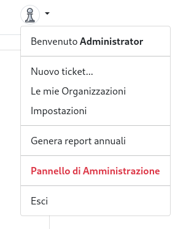

# university-ticket-system
## Requisiti Concordati con il Docente

* Ticket system 
    - Ticket (Status, Owner, CC list, date created, date closed, tags)
    - Tag (lista di tas, legati alle aree della AQ)
    - Event  (Ticket, date)
    - Sono previsti numerosi tipi di eventi (Apertura, Chiusura, Duplicato, Escalation, Note, Richiesta di Informazioni, Risposta)
    - Gli eventi possono prevedere documenti allegati
* Schedulazione di eventi: apertura di eventi in momenti prefissati. Tutti i ticket aperti devono avere un owner!
* Ruoli (Personale + Organizzazioni)
* Unimore LDAP SSO (Nome e Cognome, indirizzo di posta)
* RESTful API
* Responsive Client Side
* Notifiche via mail (da definire)
* Generazione DOCX di report per i ticket

## 1. Guida Utente

Il sito web è accessibile al link
[https://qaticket.ing.unimore.it/](https://qaticket.ing.unimore.it) per tutti gli utenti
con un account sul sistema unimore.

Per accedere basta cliccare sul bottone **Login** in alto a destra e si verrà reinderizzati
al pagina di login unimore.

È possibile accedere anche con un account locale (per test o amministazione), cliccando sul
bottone di login mentre viene premutil il tasto **Shift**, o in alternativa visitando
[questa pagina](https://qaticket.ing.unimore.it/s3cr3tl0g1n).

Una volta effettuato il login, è possibile creare nuovi Ticket, gestire le organizzazioni,
gestire le impostazioni del profilo, generare i report annuali, accedere al pannello di
amministrazione (per gli amministratori, ovviamente) ed effettuare il logout utilizzando
il menu in alto a destra.

