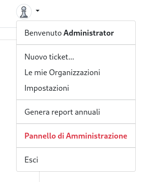
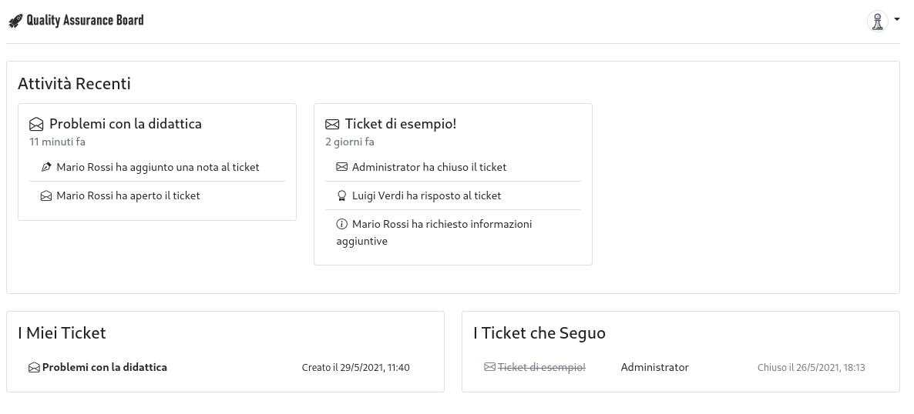
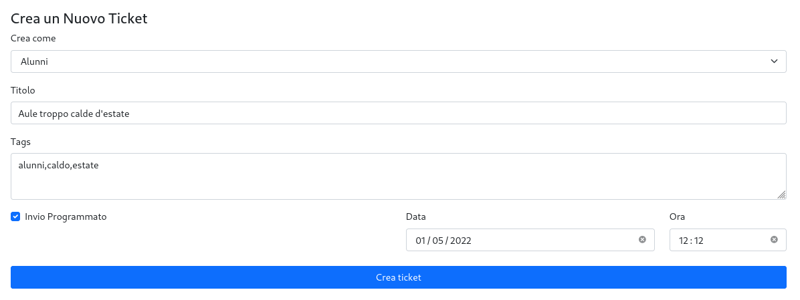
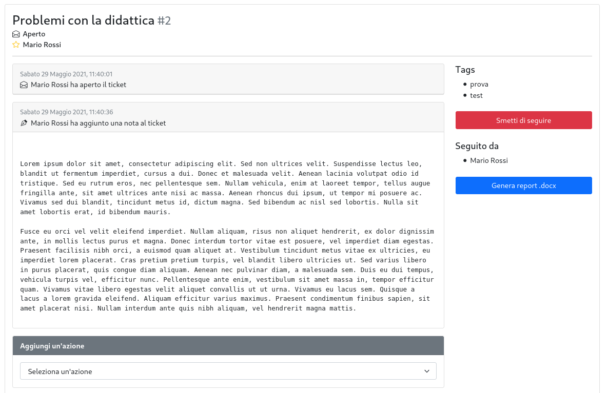
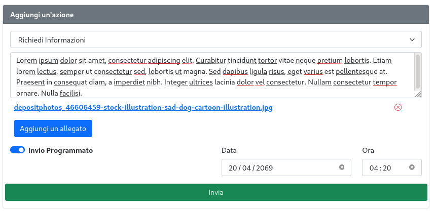
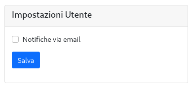
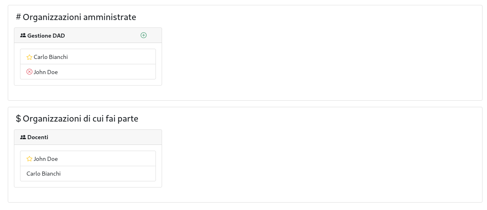
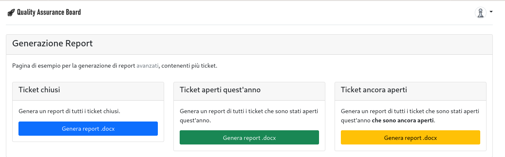

# User Guide
## Pagina principale

Il sito web è accessibile al link
[https://qaticket.ing.unimore.it/](https://qaticket.ing.unimore.it) per tutti gli utenti
con un account sul sistema UniMore.

Per accedere basta cliccare sul bottone **Login** in alto a destra e si verrà reindirizzati
alla pagina di login UniMore.

È possibile accedere anche con un account locale (per test o amministrazione), cliccando sul
bottone di login mentre viene premuto il tasto **Shift**, o in alternativa visitando
[questa pagina](https://qaticket.ing.unimore.it/s3cr3tl0g1n).

Una volta effettuato il login, è possibile
[creare nuovi ticket](#creazione-di-un-ticket),
gestire le [organizzazioni](#gestione-delle-organizzazioni),
gestire le [impostazioni del profilo](#impostazioni-del-profilo),
generare i [report annuali](#generazione-dei-report-annuali)
accedere al [pannello di amministrazione](#pannello-di-amministrazione) (per i soli amministratori, ovviamente) ed effettuare il logout utilizzando
il **menu in alto a destra**.

Sotto la barra di navigazione, è presente un riassunto delle attività recenti, la lista
di tutti i ticket personali e dei ticket seguiti.  
Cliccando sul titolo di un ticket si accederà alla
[pagina di dettaglio](#pagina-di-dettaglio-di-un-ticket).

## Creazione di un ticket

Nella pagina di creazione del ticket è possibile specificare:
* Il proprietario del ticket: se stessi come individuo o un'organizzazione di cui si fa parte
* Il titolo del ticket
* La lista dei tag associati al ticket
* Programmare l'invio del ticket nel futuro.

Quando un ticket viene creato a nome di un'organizzazione, tutti gli utenti appartenenti
alla stessa saranno automaticamente iscritti al ticket.

## Pagina di dettaglio di un ticket

Nella pagina di dettaglio del ticket sarà possibile:
 - Visualizzare il nome, il titolo, l'id e lo stato del ticket (Aperto/Chiuso)
 - Visualizzare il proprietario corrente del ticket, che permette di distinguere tra persona e
   organizzazione grazie all icona affianco al nome. 
 - Seguire o smettere di seguire il ticket.
 - Visualizzare la lista dei _Tag_ e delle persone che seguono il ticket.
 - Aggiungere un'azione al ticket con la possibilità di aggiungere **allegati** e **programmare
   l'invio**.  
   Le azioni possibili sono le seguenti:
   * Rispondere.
   * Richiedere maggiori informazioni.
   * Aggiungere una nota.
   * Marcare come duplicato.
   * **[solo proprietario]** Chiudere il ticket.
   * **[solo proprietario]** Riaprire il ticket.
   * **[solo proprietario]** Trasferire la proprietà del ticket ad un'altra persona.
 - Generare un report in formato `.docx`

## Impostazioni del profilo

Ad oggi è possibile controllare esclusivamente la ricezione di notifiche via email tramite
le impostazioni del profilo utente.  
Se l'utente abilita le notifiche, riceverà un'email ogni qualvolta si verificherà una nuova
azione su un ticket di proprietà o sottoscritto.

## Gestione delle organizzazioni

In questa pagina è possibile visualizzare sia le organizzazioni amministrate che quelle di cui
si fa parte.

Per ogni organizzazione sarà possibile visualizzare la lista degli utenti e l'amministratore.  
Per le organizzazioni amministrate, saranno disponibili due bottoni, uno per l'aggiunta e 
un altro per la rimozione degli utenti all'organizzazione.

*NOTA*: la creazione e modifica dell'amministratore delle organizzazioni è volutamente stata
limitata ai soli amministatori del sito web.

## Generazione dei report annuali

Questa pagina permette di generare tre report **avanzati** di esempio in formato `.docx`
che contengono una moltitudine di ticket.
In futuro questa pagina potrà essere espansa con la selezione di ticket specifici
o filtri avanzati.

## Pannello di amministrazione
